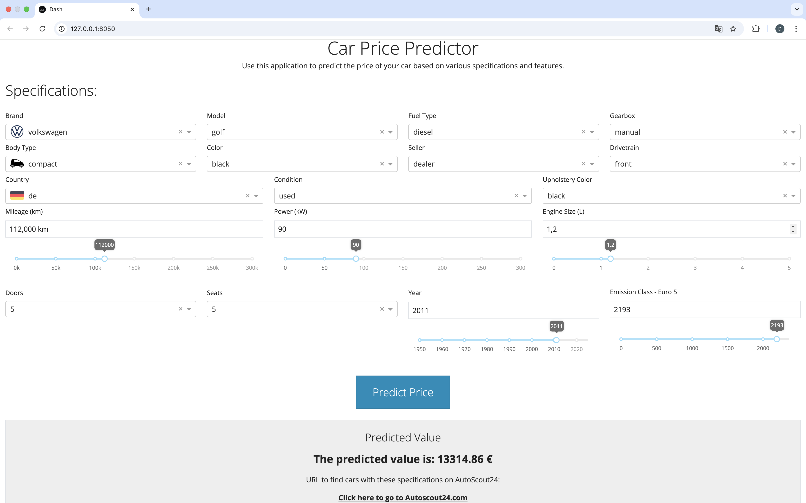

# 🚗 Car Price Predictor


## **Overview**
Car Price Predictor allows users to estimate vehicle prices using a machine learning model trained on web data, helping buyers and sellers make informed decisions.
It is a simple end-to-end data science project consisting of:
- **Data Collection**: Scraping data from autoscout24.com using Scrapy
- **Data Cleaning**: Cleaning the scraped data to remove missing values and outliers
- **Data Exploration**: Exploring the cleaned data using statistics and visualizations
- **Model Building**: Comparing different regression models to predict car prices and selecting the best one, then tuning the hyperparameters
- **Model Deployment**: Deploying the model using FastAPI
- **User Interface**: Creating a simple user interface using Dash to interact with the deployed model and access autoscoot24.com without having to re-enter the car details

## Installation and Usage
1. Make sure you have Docker installed on your machine
2. Clone the repository
3. Run the following command to build the Docker image:
```bash
docker-compose up --build
```
4. Open your browser and go to `http://0.0.0.0:8050/` to access the user interface
5. To stop all running containers, press CTRL + C or run:
```bash
docker-compose down
```